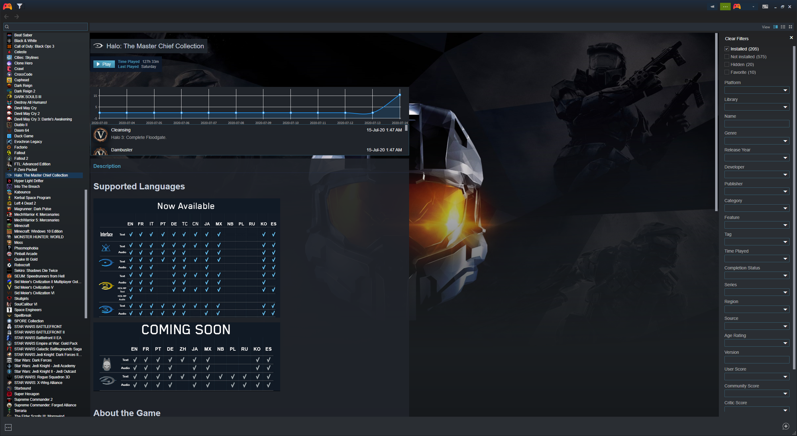
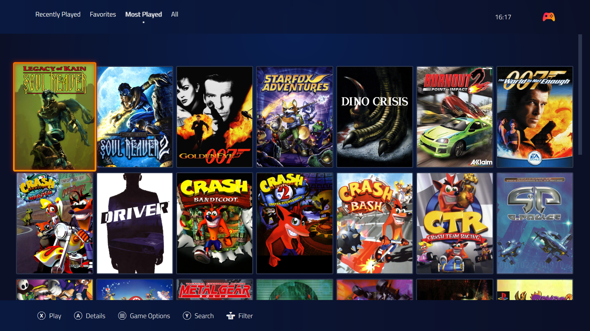
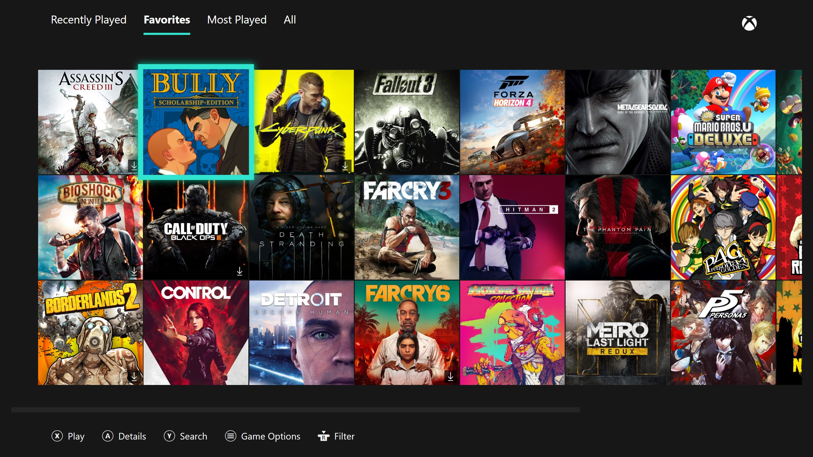

# Playnite Extension List
List of [Playnite](https://playnite.link/) Extensions and Themes. A placeholder until there is a [more robust solution](https://github.com/JosefNemec/Playnite/issues/593). Please help expand this list by [contributing](https://github.com/scowalt/PlayniteExtensionList/pulls)!

## Contents

 - [Libraries](#libraries)
 - [Metadata](#metadata)
 - [Generic](#generic)
 - [Themes - Desktop mode](#themes---desktop-mode)
 - [Themes - Fullscreen mode](#themes---fullscreen-mode)

## Libraries
[Official Playnite forums](https://playnite.link/forum/forum-7.html)

| Name | Author | Description |
|:-----|:------:|:------------|
| [IndieGala](https://github.com/Lacro59/playnite-indiegala-plugin) | [Lacro59](https://github.com/Lacro59) | The plugin "IndiegalaLibrary" get games library from Indiegala in Showcase, Bundles & Store. |
| [Oculus Library](https://github.com/Shawson/Playnite-OculusLibrary) | [Shawson](https://github.com/Shawson) | Plugin for Playnite to add support for importing games from the Oculus store. |
| [Rockstar Library](https://github.com/JosefNemec/PlaynitePlugin-RockstarLibrary) | [JosefNemec](https://github.com/JosefNemec) | This is a Playnite plugin that automatically imports games from Rockstar Games launcher.

## Metadata
[Official Playnite forums](https://playnite.link/forum/forum-17.html)

| Name | Author | Description |
|:-----|:------:|:------------|
| [EmuMovies Metadata](https://github.com/spektor56/EmuMoviesPlaynitePlugin) | [spektor56](https://github.com/spektor56) |
| [Launchbox Metadata](https://github.com/spektor56/LBGDBPlaynitePlugin) | [spektor56](https://github.com/spektor56) |
| [Metadatalocal](https://github.com/Lacro59/playnite-metadatalocal-plugin) | [Lacro59](https://github.com/Lacro59) | This plugin gets localised game description from Steam, Origin, Epic Game Store & Windows Store. |
| [RAWG Metadata plugin](https://github.com/spektor56/RAWGPlaynitePlugin) | [spektor56](https://github.com/spektor56) | |
| [Steam Store Metadata](https://github.com/JosefNemec/PlaynitePlugin-SteamStoreMetadata) | [JosefNemec](https://github.com/JosefNemec) | This is a Playnite plugin that gives you an option to download game information from Steam store even for games that are not imported from Steam. |
| [SteamGridbDB Metadata](https://github.com/cooperate/SteamGridDBMetadata) | [cooperate](https://github.com/cooperate) | SteamGridDB Metadata is a provider for Playnite that leverages the SteamGridDB api to curate your artwork. |
| [VNDB](https://github.com/Mithnar/PlayniteVndb) | [Mithnar](https://github.com/Mithnar) |

## Generic
[Official Playnite forums](https://playnite.link/forum/forum-6.html)

| Name | Author | Description |
|:-----|:------:|:------------|
| [CheckLocalizations](https://github.com/Lacro59/playnite-checklocalizations-plugin) | [Lacro59](https://github.com/Lacro59) | This plugin gets data on game localizations for show in Playnite.
| [DescriptionEditor](https://github.com/Lacro59/playnite-descriptioneditor-plugin) | [Lacro59](https://github.com/Lacro59) | This plugin can edit and preview the game description with some presets.
| [Extensions Updater](https://github.com/erri120/Playnite.Extensions#extensions-updater) | [erri120](https://github.com/erri120) | This is a generic plugin which can check if your extension needs an update.
| [GameActivity](https://github.com/Lacro59/playnite-gameactivity-plugin) | [Lacro59](https://github.com/Lacro59) | This plugin creates datas for your game activy.
| [Get Steam Cover Images](https://gist.github.com/bburky/464543d4c6662c66ad6088d06ced50ce) | [bburky](https://gist.github.com/bburky) | Replaces the cover image of the selected games with the Steam header image for the game. |
| [HowLongToBeat](https://github.com/Lacro59/playnite-howlongtobeat-plugin) | [Lacro59](https://github.com/Lacro59) | This plugin gets How Long To Beat in application database. |
| [Import Installed Discord Games](https://gist.github.com/bburky/43e666b2f6bb6db4c42b5ecd93f7af38) | [bburky](https://gist.github.com/bburky) | |
| [IsThereAnyDeal](https://github.com/Lacro59/playnite-isthereanydeal-plugin) | [Lacro59](https://github.com/Lacro59) | This plugin get Is There Any Deal in application database from store wish list (Steam, GOG, Origin, Epic Game Store, Humble, Windows Store). |
| [Is There Any Deal Collection Sync](https://gist.github.com/bburky/38c29a5fd8fbf2fc72ef77d553d09c6a) | [bburky](https://gist.github.com/bburky) | |
| [Ludusavi](https://github.com/mtkennerly/ludusavi-playnite) | [mtkennerly](https://github.com/mtkennerly) | plugin to back up your save data using Ludusavi |
| [Non-Steam Shortcut Extension](https://github.com/bburky/playnite-non-steam-shortcuts) | [bburky](https://github.com/bburky) | This extension will automatically creates non-Steam shortcuts for the currently selected games in Playnite. |
| [Playnite Sounds](https://github.com/joyrider3774/PlayniteSound) | [joyrider3774](https://github.com/joyrider3774) | Playnite Sounds is an extension to play audio files during Playnite events. It can only play WAV audio files and nothing else.
| [Screenshot Plugin](https://github.com/erri120/Playnite.Extensions#screenshot-plugin) | [erri120](https://github.com/erri120) | Plugin made using parts of the ShareX ScreenCaptureLib. This little plugin will capture different region on when pressing a hotkey.
| [Simple Game Importer](https://github.com/joyrider3774/Playnite_Simple_Game_Importer) | [joyrider3774](https://github.com/joyrider3774) | It's a plugin to add "virtual games" so you can add for example games from platforms that do not automatically import.
| [SuccessStory](https://github.com/Lacro59/playnite-successstory-plugin) | [Lacro59](https://github.com/Lacro59) | This plugin get the game achievements in application. |
| [SystemChecker](https://github.com/Lacro59/playnite-systemchecker-plugin) | [Lacro59](https://github.com/Lacro59) | This plugin gets the game requiere configuration and check with your configuration in application. |
| [ThemeModifier](https://github.com/Lacro59/playnite-thememodifier-plugin) | [Lacro59](https://github.com/Lacro59) | The plugin can edit some element from current theme.     |

## Themes - Desktop mode
[Official Playnite forums](https://playnite.link/forum/forum-8.html)

| Name | Author | Description | Screenshot |
|:-----|:------:|:------------|:----------:|
| [Blupur](https://github.com/sevenns/Playnite-Blupur-Theme) | [sevenns](https://github.com/sevenns) | | 
| [Classic Steam](https://playnite.link/forum/thread-299-post-1888.html) | [Xyifer12](https://gitlab.com/xyifer12) | A theme I built for myself because I like an older version of the Steam layout. | 
| [eMixedNite](https://playnite.link/forum/thread-337.html) | [eminaguil](https://playnite.link/forum/user-725.html) | | 
| [Enhanced Grid View 2.0](https://playnite.link/forum/thread-311.html) | [Cromi](https://playnite.link/forum/user-1612.html) | | 
| [Harmony](https://github.com/darklinkpower/Harmony) | [darklinkpower](https://github.com/darklinkpower) | Clean theme with modern design for Playnite Desktop Mode | 
| [Stardust](https://github.com/darklinkpower/Stardust) | [darklinkpower](https://github.com/darklinkpower) | Theme inspired by GOG Galaxy 2.0 | 
| [SteamNite](https://github.com/Deytron/SteamNite) | [Deytron](https://github.com/Deytron) | A custom theme that mimics the Steam client's look for Playnite | 
| [XBOX Library](https://playnite.link/forum/thread-312.html) | [kersalmassive](https://playnite.link/forum/user-1606.html) | Playnite Desktop theme based on the XBOX One 'My Games & Apps' Library | 

## Themes - Fullscreen mode
[Official Playnite forums](https://playnite.link/forum/forum-12.html)

| Name | Author | Description | Screenshot |
|:-----|:------:|:------------|:----------:|
| [Aurora](https://playnite.link/forum/thread-255.html) | [geraintthomas](https://playnite.link/forum/user-1060.html) | A clean and modern variant of the original theme with white highlights. | 
| [Blupur](https://github.com/sevenns/Playnite-Blupur-Theme) | [sevenns](https://github.com/sevenns) | | 
| [Orbis](https://gitlab.com/xyifer12/orbis-playnite-theme) | [Xyifer12](https://gitlab.com/xyifer12) | A theme for Playnite that aims to replicate the PS4 UI. | 
| [PlayOS](https://github.com/Deytron/PlayOS) | [Deytron](https://github.com/Deytron) | A fullscreen theme for Playnite inspired by the GameOS theme for Pegasus. This theme aims to be as minimal as possible. | 
| [SwitchNite](https://github.com/Deytron/SwitchNite) | [Deytron](https://github.com/Deytron) | A Playnite theme that mimics the Switch's interface. | 
| [XBOX One Theme](https://playnite.link/forum/thread-325.html) | [kersalmassive](https://playnite.link/forum/user-1606.html) | Playnite Fullscreen theme based on the XBOX One 'My Games & Apps' dashboard |  |
| [XBOX Series Theme](https://playnite.link/forum/thread-397.html) | [kersalmassive](https://playnite.link/forum/user-1606.html) | Based on the new XBOX dashboard for the Series S\|X |  |

# Disclaimer

This resource is purely for informational purposes. Inclusion in this list doesn't imply an endorsement of the extension, the extension author, or the data source.
